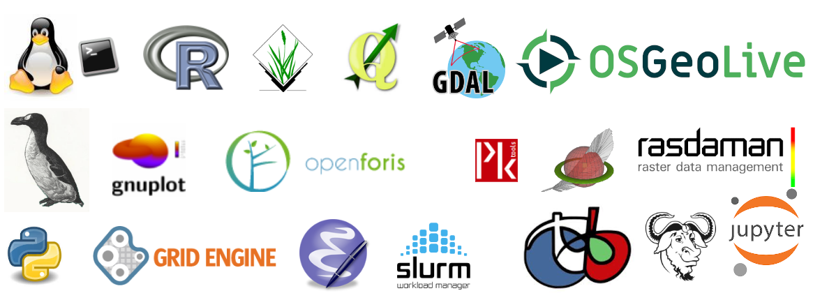

.. _mainindex:

===================================================================
Documentacion de Software libre para curso de ecología espacial

Free & OpenSource Software Documentation for BigGeoData Processing
===================================================================

**Welcome to the Spatial Ecology's documentation!** The content of this documentation is free and open source, (CC-BY-SA license) it can be used, but WITHOUT ANY WARRANTY. You can remix, tweak, and build upon our work as long as you credit us and license your new creations under the identical terms. Software we use have a GNU General Public License GPL or GPL / MIT compatible licenses.

Table of Contents 
============================================

.. toctree::
   :maxdepth: 1
   :caption: PROFESSORES

   PROFESSORES/index

.. toctree::
   :maxdepth: 1      
   :caption: MAQUINA VIRTUAL DE LINUX

   VIRTUALMACHINE/index
   
.. toctree::
   :maxdepth: 1
   :caption: BASH

   BASH/index

Indices and tables
==================

* :ref:`genindex`
* :ref:`modindex`
* :ref:`search`

